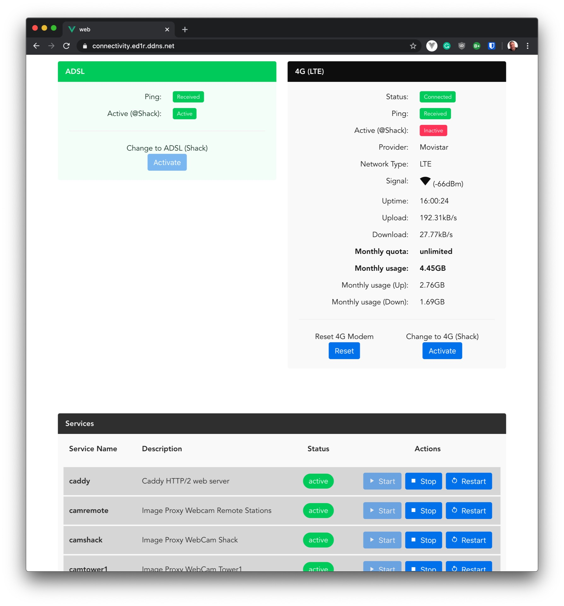

# Infractl

Infractl is a collection of tools which have been developed to monitor
& control the network infrastructure at ED1R.

With infractl you can either execute commands through the command line
or through a built-in webserver with a REST interface.

## Features

- Reset 4G Modem connected to a Microtik Routerboard
- check status of routes (ip/route) on a Microtik Routerboard
- set parameters on routes (ip/route) on a Microtik Routerboard
- Check connectivity (ping) to serveral IP addresses / urls
- Control systemd services
- Get the detailed status of a ZTE MF823 4G USB Modem

## Config file

The repository contains an example configuration file. By convention it is called
`.infractl.[yaml|toml|json]` and is located by default either in the
home directory or the directory where the infractl executable is located.
The format of the file can either be in
[yaml](https://en.wikipedia.org/wiki/YAML),
[toml](https://github.com/toml-lang/toml), or
[json](https://en.wikipedia.org/wiki/JSON).

The first line after starting infractl will indicate if / which config
file has been found.

You can also use config files located in an arbitray directory using --config flag.

Priority:

1. Pflags (e.g. -a 192.168.1.1 -p 6886)
2. Values from config file
3. Environment variables
4. Default values

## License

infractl is published under the permissive [MIT license](https://github.com/dh1tw/infractl/blob/master/LICENSE).

## Documentation

The auto generated documentation can be found at
[godoc.org](https://godoc.org/github.com/dh1tw/infractl).
